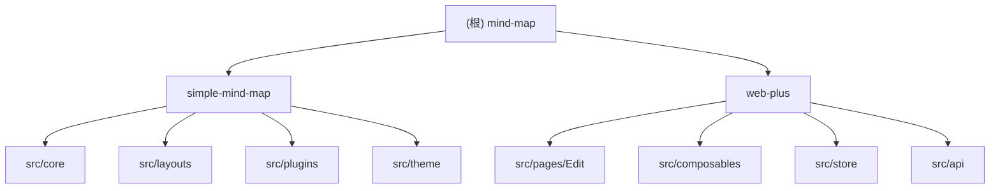

<!-- OPENSPEC:START -->
# OpenSpec Instructions

These instructions are for AI assistants working in this project.

Always open `@/openspec/AGENTS.md` when the request:
- Mentions planning or proposals (words like proposal, spec, change, plan)
- Introduces new capabilities, breaking changes, architecture shifts, or big performance/security work
- Sounds ambiguous and you need the authoritative spec before coding

Use `@/openspec/AGENTS.md` to learn:
- How to create and apply change proposals
- Spec format and conventions
- Project structure and guidelines

Keep this managed block so 'openspec update' can refresh the instructions.

<!-- OPENSPEC:END -->
# CLAUDE.md

This file provides guidance to Claude Code (claude.ai/code) when working with code in this repository.

## 变更记录 (Changelog)

| 时间 | 操作 | 说明 |
|------|------|------|
| 2026-01-17T22:28:39+0800 | 初始化 | AI 上下文首次初始化，完成全仓扫描 |
| 2026-02-03 | 优化 | 侧边栏按 activeSidebar 按需挂载，减少 el-popper-container 下 el-popover 预加载；补充 Popover 最佳实践说明 |

---

## 项目愿景

simple-mind-map 是一个功能强大的 Web 思维导图开源项目，提供：
- 框架无关的核心渲染引擎（纯 JavaScript + SVG.js）
- 完整的用户界面和交互体验（Vue 3 + Element Plus）
- 丰富的插件系统支持功能扩展
- 多种布局方式和主题样式
- AI 辅助创建和编辑功能

---

## 架构总览

项目采用 Monorepo 架构，包含两个主要模块：

```
mind-map/
├── simple-mind-map/     # 核心思维导图引擎库
│   ├── index.js         # 最小核心入口
│   ├── full.js          # 完整版入口（预注册所有插件）
│   └── src/
│       ├── core/        # 核心模块（渲染、事件、命令、视图）
│       ├── layouts/     # 布局引擎（9种布局方式）
│       ├── plugins/     # 插件系统（24个功能插件）
│       ├── theme/       # 主题系统
│       ├── parse/       # 数据格式解析
│       └── utils/       # 工具函数
│
└── web-plus/            # Vue 3 Web 应用
    ├── src/
    │   ├── pages/Edit/  # 主编辑器页面及组件
    │   ├── composables/ # Vue 3 组合式函数
    │   ├── store/       # Pinia 状态管理
    │   ├── api/         # 数据持久化 API
    │   └── config/      # 配置文件
    └── vite.config.ts   # Vite 构建配置
```

---

## 模块结构图



---

## 模块索引

| 模块路径 | 语言 | 职责 | 入口文件 | 测试 |
|----------|------|------|----------|------|
| `simple-mind-map/` | JavaScript | 思维导图核心引擎库 | `index.js`, `full.js` | 无 |
| `web-plus/` | TypeScript/Vue 3 | Web 应用界面 | `src/main.ts` | 无 |

---

## 运行与开发

### 核心库（simple-mind-map/）

```bash
cd simple-mind-map
npm install

npm run lint      # ESLint 代码检查
npm run format    # Prettier 格式化
npm run types     # 生成 TypeScript 类型定义
npm run wsServe   # 启动 WebSocket 协作服务器
```

### Web 应用（web-plus/）

```bash
cd web-plus
pnpm install

pnpm dev          # 启动开发服务器
pnpm build        # 构建生产版本
pnpm preview      # 预览构建结果
```

### 开发工作流

1. **修改核心库代码** -> web-plus 会自动监听变化并热更新
2. **Vite 配置**已设置 `simple-mind-map` 别名指向源码目录，开发时无需手动构建

---

## 测试策略

当前项目**无自动化测试套件**，依赖手动测试：

1. 运行 `npm run lint`（在 simple-mind-map 中）
2. 启动 `pnpm dev`（在 web-plus 中）进行功能测试
3. 验证关键功能：
   - 节点编辑（添加、删除、移动）
   - 导入导出（JSON、PNG、PDF、XMind）
   - 布局切换
   - 主题切换
   - 协作功能（需要 `npm run wsServe`）

---

## 编码规范

### 核心库（simple-mind-map/）

- **ESLint**: `eslint:recommended`
- **Prettier**:
  - 2 空格缩进
  - 无分号 (`semi: false`)
  - 单引号 (`singleQuote: true`)
  - 80 字符行宽

### Web 应用（web-plus/）

- **TypeScript** 严格模式
- **Vue 3 Composition API** + `<script setup>`
- **组件命名**: PascalCase
- **国际化**: 所有用户可见文本通过 `src/lang/` 国际化

---

## AI 使用指引

### 添加新功能时的决策

1. **判断功能归属**：
   - 核心渲染/布局/节点逻辑 -> `simple-mind-map/src/plugins/` 或 `src/core/`
   - UI 控件、对话框、用户交互 -> `web-plus/src/pages/Edit/components/`

2. **状态管理**：
   - 跨组件共享状态 -> Pinia store
   - 一次性事件通知 -> 事件总线 (mitt)

3. **插件开发**：
   - 继承插件基类模式
   - 使用 `MindMap.usePlugin(PluginClass)` 注册
   - 插件列表在 `simple-mind-map/full.js`

### 常见任务

| 任务 | 位置 |
|------|------|
| 添加新布局 | `simple-mind-map/src/layouts/` |
| 添加新插件 | `simple-mind-map/src/plugins/` |
| 添加新主题 | `simple-mind-map/src/theme/` |
| 添加 UI 组件 | `web-plus/src/pages/Edit/components/` |
| 添加 API | `web-plus/src/api/` |
| 添加国际化文本 | `web-plus/src/lang/` |

### ElPopover / el-popper-container 最佳实践

- **问题**：Element Plus 的 `el-popover` 在组件挂载时就会把内容渲染到 `el-popper-container`，若大量侧边栏/面板同时挂载，会导致大量 popover 预加载，影响首屏与内存。
- **做法**：对由 `activeSidebar` 控制的侧边栏（Style、BaseStyle、Theme、Structure、Setting 等），在 `MindMapContainer` 中按需挂载：仅当 `activeSidebar === '对应值'` 时再挂载该组件（`v-if="mindMapInstance && activeSidebar === 'xxx'"`），避免未打开的侧边栏及其内部 popover 一起加载。
- **例外**：依赖事件监听才能打开的面板（如 NodeOuterFrame 监听 `outer_frame_active`）需常驻挂载，不能按 activeSidebar 懒挂载。

### 安全注意事项

- **切勿提交 API 密钥**：AI 功能的密钥应本地配置
- **集成保护**：支持桌面应用、Obsidian、UTools 等集成模式

---

## 技术栈

### 核心库

| 依赖 | 版本 | 用途 |
|------|------|------|
| @svgdotjs/svg.js | 3.2.0 | SVG 渲染 |
| quill | ^2.0.3 | 富文本编辑 |
| katex | ^0.16.8 | 数学公式 |
| yjs | ^13.6.8 | 实时协作 |
| pdf-lib | ^1.17.1 | PDF 导出 |

### Web 应用

| 依赖 | 版本 | 用途 |
|------|------|------|
| vue | ^3.5.24 | 前端框架 |
| pinia | ^3.0.4 | 状态管理 |
| element-plus | ^2.13.1 | UI 组件库 |
| vue-i18n | ^9.14.4 | 国际化 |
| vite (rolldown-vite) | 7.2.5 | 构建工具 |

---

## 版本信息

- **当前版本**: 0.14.0-fix.20
- **许可证**: MIT
- **仓库**: https://github.com/wanglin2/mind-map
